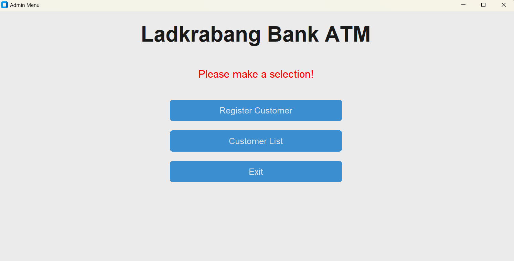
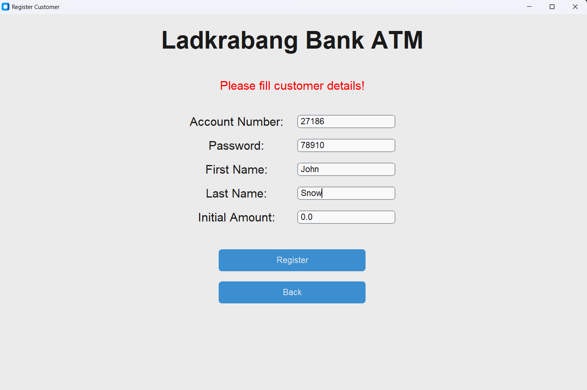
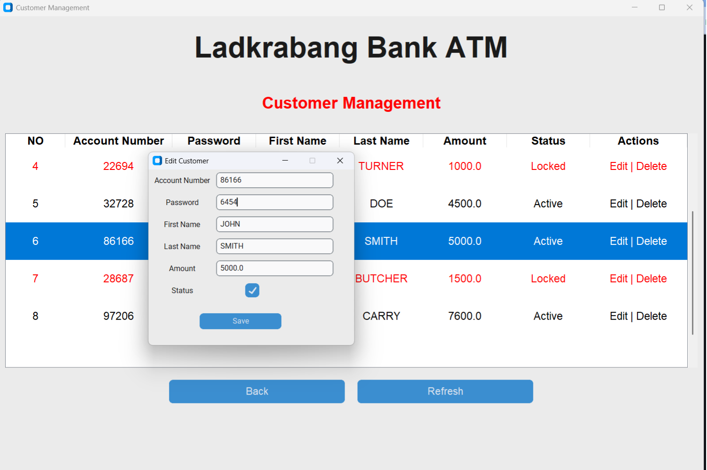
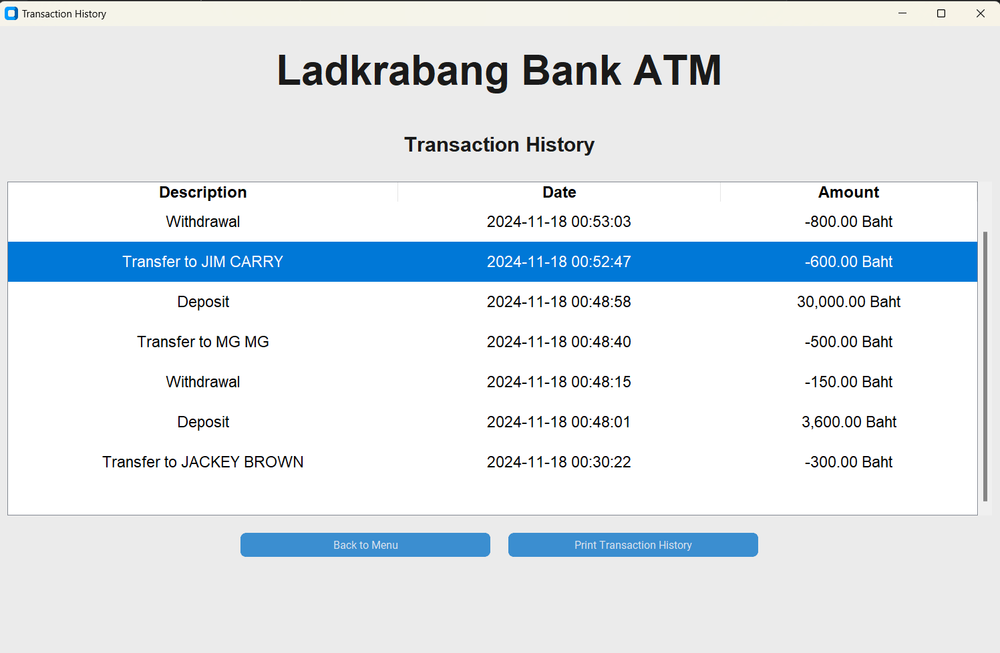

# Simple ATM Simulator

## Project Overview

‘Simple ATM Simulator’ is a secure and efficient simulation of a real Automatic Teller Machine (ATM) system, designed using Python's Tkinter module for the graphical user interface (GUI) and the pickle module for smooth data management. The application supports two distinct user roles: Admin and Customer. Admin can register new customers and manage existing accounts, while customers can carry out various banking operations such as transferring funds, withdrawing money, and viewing transaction history slips.
This project utilizes Python’s object-oriented programming (OOP) principles, including inheritance and composition, to structure the application efficiently. Different screens are encapsulated within dedicated classes such as UserMenu, Transfer, and TransactionHistory, enabling smooth transitions between them and improving both usability and code maintainability.

Admin email and password is hardcoded in 'config.py'.

## Screenshots

### Admin Views





### Customer Views





## Key Features

### Admin Role:

-   Register New Customers: Add new customer accounts and view a list of all existing customers.
-   Delete Customer Accounts: Permanently remove customer accounts.
-   Account Management: Lock and unlock customer accounts, rendering inactive accounts unable to perform any banking operations.
-   Edit Customer Information: Update personal details such as first name, last name, and password. (Account number and balance are immutable.)

## Customer Role:

-   Banking Operations: Check account balance, deposit funds, withdraw money, and transfer funds between accounts.
-   Receipt Printing: Optionally generate receipts after deposits, withdrawals, or transfers, saved in ‘.txt’ format.
-   Transaction History: Log all transactions with timestamps and allow customers to view or print their transaction history slips.

## Installation and How to Run

1. Clone this repository and go to the project directory:

    ```bash
    git clone https://github.com/SawZiDunn/ATM-Simulator.git
    cd ATM-Simulator
    ```

2. Ensure that your install all the modules

    ```bash
    pip install -r requirements.txt
    ```

3. To run the program as admin role:

    ```bash
    python admin.py
    ```

    To run the program as customer role:

    ```bash
    python app.py
    ```

## Dependencies

-   tkinter & customtkinter: Standard GUI toolkit.

-   pickle: For data serialization.

-   sys: Provides system-specific parameters and functions.

-   datetime: For managing timestamps in transaction history.
